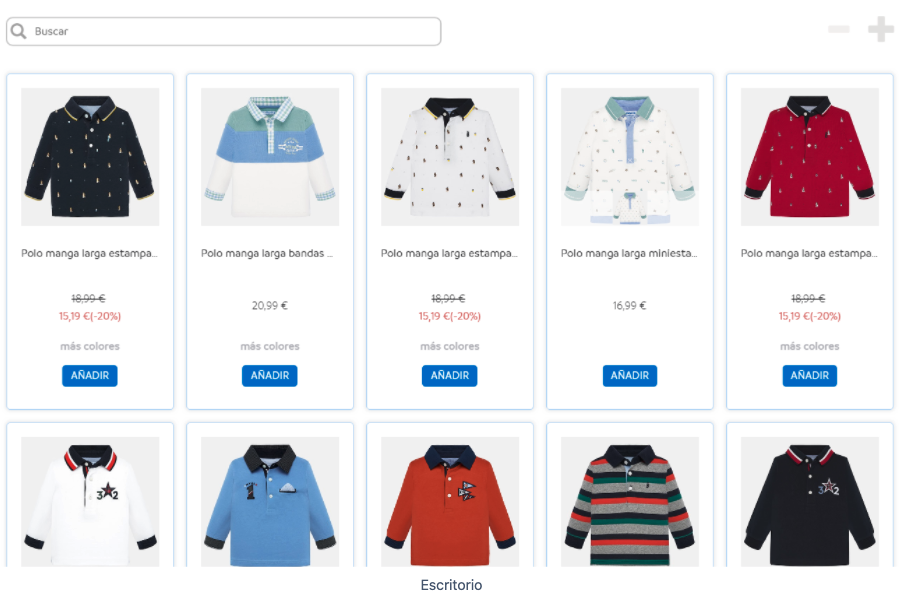

# Mayoral Frontend Assignment

|              Desktop              |             Mobile              |
| :-------------------------------: | :-----------------------------: |
|  |  |

Maquetar las imágenes adjuntas y tener en cuenta los diferentes cortes en móvil y escritorio. La prueba deberá estar subida en un repositorio de GitHub.

Tecnologías/Librerías requeridas:

- React
- Typescript
- Next.js

Funcionalidad a implementar:

- Separa en componentes de una forma óptima y organizada
- La vista debe asemejarse lo más parecido posible a las fotos adjuntas
- Implementar búsqueda de productos por nombre
- Consumir un JSON con los datos de productos (JSON local o externo)
- Cambiar la vista con los iconos indicados en la foto:
  - Escritorio de 4 a 3 elementos
  - Móvil de 3 a 2 elementos
- Implementar lógica y diseño de un componente “ordenar” (precio ascendente y descendente)
- Crea los test unitarios que creas conveniente

Notas:

- Me he tenido que formar un poco con Next.js ya que no lo había usado nunca. Aunque en la prueba tampoco se saca jugo de sus métodos.
- Me he tenido que adaptar a usar React.js con Typescript, ya que normalmente lo uso con js vanilla.
- Los tests se han hecho, pero no se han probado ya que por problemas con ciertos archivos de TS en mi PC me daban bastantes errores, y al arreglarlos salían más. He decidico escribirlos y no ejecutarlos, confiando en que están bien hechos por mi experiencia.
- La esctructura de archivos quizás no siga las mejores practicas de next.js. Como he comentado, no estoy familiarizado con el framework y tiene algunas cosas diferentes a usar React.js a secas.
- No he usado ninguna librería extra, ya que entendía por la descripción de la prueba que no se permitía. Hubiese usado algun posprocesador de css y alguna librería de componentes para agilizar el trabajo.
